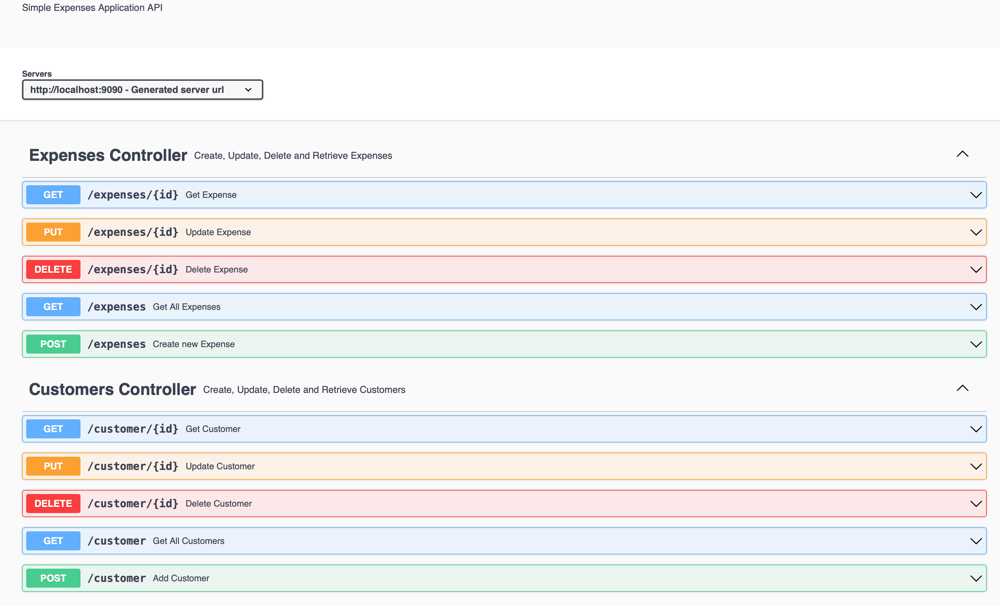
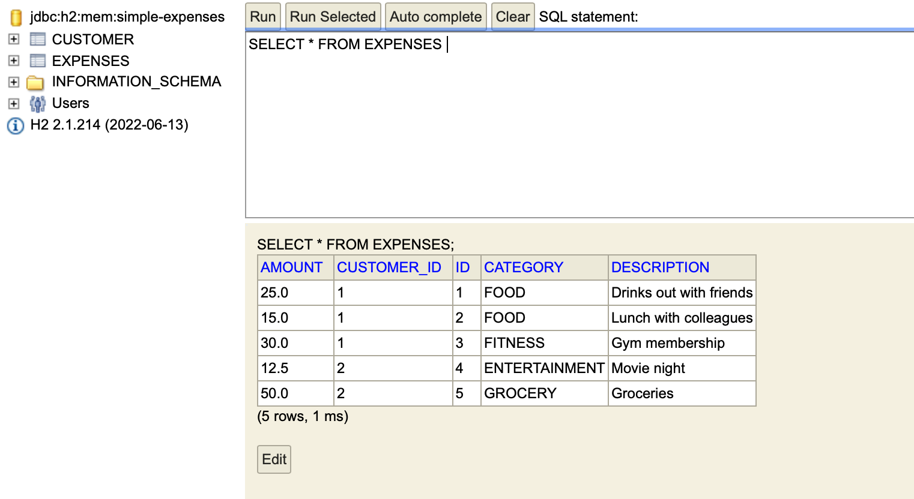
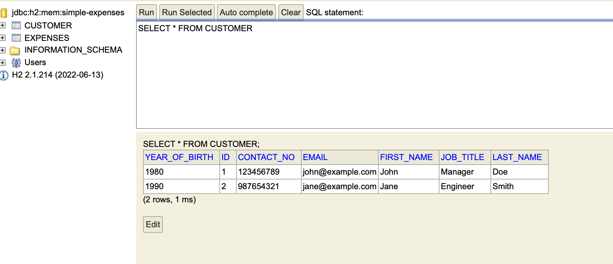

# NTU Software Engineering Spring Boot Activities

This repository contains a collection of Spring Boot exercises and activities completed as part of the Software Engineering course at Nanyang Technological University (NTU). Each folder in this repository represents a different activity or exercise.

## Table of Contents

- [Introduction](#introduction)
- [Getting Started](#getting-started)
- [Activities List](#activities-list)
- [Contributing](#contributing)
- [License](#license)

## Introduction

This repository serves as a showcase of my journey through the Spring Boot exercises and activities in the NTU Software Engineering course. It includes solutions to various programming challenges and concepts taught during the course. In addition to the course exercises, I've also included some of the projects I've independently developed.

## Getting Started

If you're a fellow student or developer interested in Spring Boot, feel free to explore the exercises and projects in this repository. You can clone this repository to your local machine using the following command:

```bash
git clone https://github.com/JustenMX/ntu-springboot-activities
```

Each activity is stored in its respective folder, and you can navigate to each activity to find the Spring Boot files and BRIEF.md with specific instructions.

### Accessing Activity Instructions

Each activity is organized within its respective folder. To find the instructions for each activity, follow these steps:

1. Locate the `resources` folder in the project directory.

2. Inside the resources/documentation folder, you will find the `BRIEF.md` file.

3. Open the `BRIEF.md` file to access detailed instructions and guidelines for the activity.

Here's a quick example:

Suppose you want to access the instructions for the "springboot-workshop." You would follow this path:

```
springboot-workshop/
└── src/
    └── main/
        └── resources/
            └── documentation/
                └── BRIEF.md

```

## Activities List

Here is a list of activities included in this repository:

1. [Activity 1: Introduction to Spring Boot](/activity1)
2. [Activity 2: Maven, Components and Annotations, Rest Controller](/activity2)
<!-- 3. [Activity 5: Java Persistent API](/activity5)
3. [Activity 6: Test-Driven Development](/activity6) -->

---

In addition to the course exercises, I've also included some of the projects I've independently developed.

## Project 1: Springboot Expenses Tracker

**Repository Link:** [Project 1: Springboot Expenses Tracker](/simple-expenses)

### Project Timeline

### Phase 1: Initial API Setup

- **Status:** Completed

Developed a small-scale expenses API with various functions and endpoints within the controller layer.

### Phase 2: Code Refactoring and Architecture Enhancement

- **Status:** Completed

Refactored the codebase to adopt a structured architecture with data, service, and controller layers. Leveraged new concepts and practices to improve the project's scalability and maintainability.

### Phase 3: Data Layer Implementation

- **Status:** Completed

Created the ExpensesRepository for data management, initially using an ArrayList. Explored basic data handling techniques as the project took its initial shape.

### Phase 4: API Documentation with Swagger and OpenAPI

- **Status:** Completed

Set up comprehensive API documentation using Swagger and OpenAPI. Improved project documentation practices and enhanced user experience.



### Phase 5: Code Refinement and Expansion

- **Status:** Completed

Continued code refactoring with a focus on improving the controller layer's readability. Embraced newfound knowledge to expand the project's capabilities and structure.

### Phase 6: Integration with In-Memory H2 Database and JPA

- **Status:** Completed

Integrated the project with an in-memory H2 database using Java Persistence API (JPA). Gained insights into database integration, further expanding the project's scope.

### Phase 7: Further Code Refactoring

- **Status:** Completed

Conducted additional code refactoring across various aspects of the project. Added a new Interface class and established OneToMany and ManyToOne relationships to current Expenses and Customer classes. Added nested routes to add Expenses to Customer classes. Applied enhanced coding practices and patterns to accommodate new learnings.




### Phase 8: Future Steps

- **Status:** Ongoing

Planned future steps, including integrating the project with a PostgreSQL database for enhanced scalability and persistence.

Please click on the links to navigate to each activity's folder and explore the related materials.

## Contributing

If you would like to contribute to this repository by adding your own solutions to the activities or improving existing ones, feel free to submit a pull request. Contributions are welcome and appreciated! See the [CODE OF CONDUCT](/CODE_OF_CONDUCT.MD) for more details.

## License

This project is licensed under the MIT License. See the [LICENSE](/LICENSE) file for more details.

## Credits

[](https://www.ntu.edu.sg)
